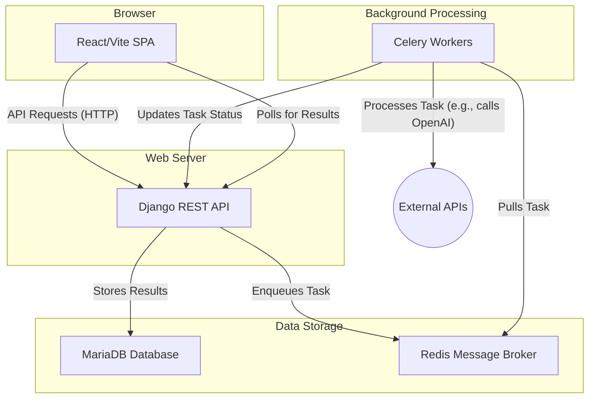
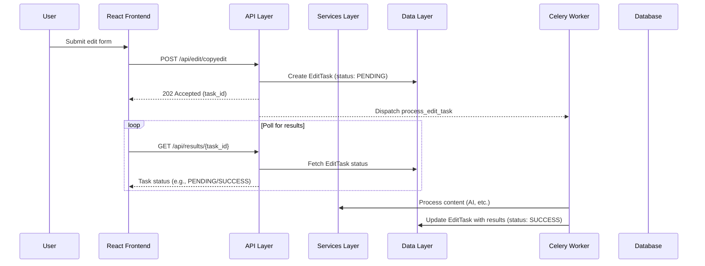
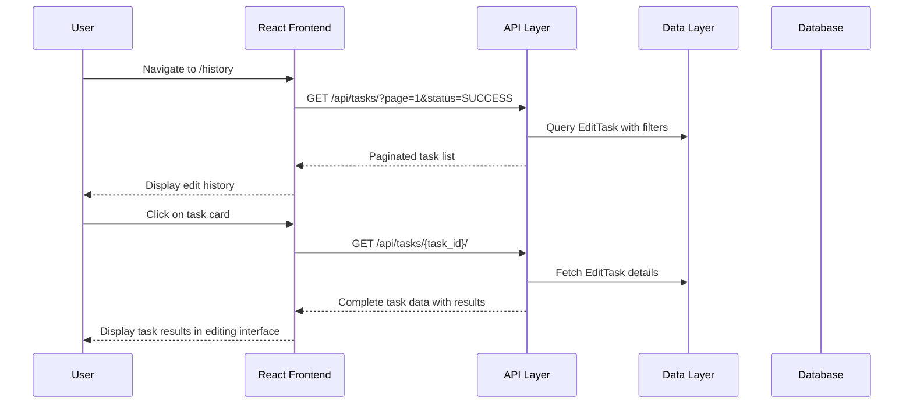
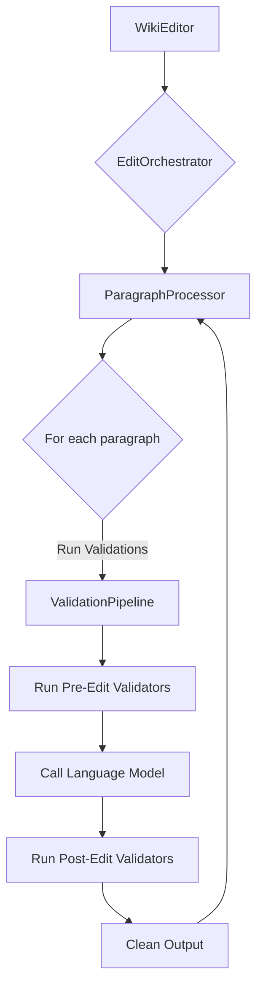

# EditEngine Architecture

EditEngine is a Django-based web application that provides AI-powered copyediting services for Wikipedia articles. It features a clean three-tier architecture with clear separation of concerns, following SOLID principles and modern software design patterns.

**Documentation:** For project overview and features, see [README.md](README.md). For development setup and contribution guidelines, see [CONTRIBUTING.md](CONTRIBUTING.md).

## Project Overview

EditEngine allows users to:

- Edit Wikipedia articles or raw wikitext using AI (OpenAI GPT or Google Gemini)
- Process content in different modes (copyedit, brevity, etc.)
- View structured diffs showing before/after changes
- Validate edits through a comprehensive validation pipeline
- Handle asynchronous processing with Celery
- Browse edit history with filtering and pagination
- View detailed results from previous edit tasks

## High-Level Architecture



## Three-Tier Architecture

EditEngine follows a clean three-tier architecture with clear separation of concerns:

### Tier 1: API Layer (Thin)

**Purpose**: Handle HTTP requests/responses, authentication, serialization, and routing
**Location**: `api/` (top-level folder)

### Tier 2: Services Layer (Fat)

**Purpose**: Core business logic, domain services, and orchestration
**Location**: `services/` (top-level folder)

### Tier 3: Data Layer (Thin)

**Purpose**: Data models, repository patterns, and data access
**Location**: `data/` (top-level folder)

## Directory Structure

### Root Level

- `EditEngine/` - Django project configuration
- `api/` - API Layer (Thin)
- `services/` - Services Layer (Fat)
- `data/` - Data Layer (Thin)
- `client/` - Frontend Django app (serves React application)
- `tests/` - Test Layer (mirrors the three-tier structure)
- `venv/` - Python virtual environment
- `staticfiles/` - Collected static files for production

### Django Project Configuration (`EditEngine/`)

- `settings.py` - Django settings with MariaDB, Redis, and Celery configuration
- `urls.py` - Main URL routing configuration
- `celery.py` - Celery configuration for background tasks
- `wsgi.py` / `asgi.py` - WSGI/ASGI application entry points

### API Layer (`api/`)

**Purpose**: Handle HTTP requests/responses, authentication, serialization, and routing

#### Structure

- `views/` - REST API endpoints
  - `edit_views.py` - EditView, ResultView, SectionHeadingsView, EditTaskListView, EditTaskDetailView
- `serializers/` - Data serialization/deserialization
  - `edit_serializers.py` - Edit request/response serializers
- `urls.py` - API URL routing
- `middleware/` - API middleware
- `exceptions/` - API exception handling

#### API Endpoints

- `POST /api/edit/{editing_mode}` - Submit edit request
- `GET /api/results/{task_id}` - Get edit results
- `GET /api/section-headings` - Get section headings
- `GET /api/tasks/` - List edit tasks with filtering
- `GET /api/tasks/{task_id}/` - Get specific task details

### Services Layer (`services/`)

**Purpose**: Core business logic, domain services, and orchestration

#### Core (`services/core/`)

- `interfaces.py` - Abstract base classes and data structures
- `factories.py` - Factory classes for creating service instances
- `constants.py` - Core constants and configuration
- `data_constants.py` - Regional spelling variants data

#### Document Processing (`services/document/`)

- `parser.py` - Parses wikitext into structured components
- `classifier.py` - Classifies content types and determines processing eligibility

#### Editing Engine (`services/editing/`)

- `edit_service.py` - Main `WikiEditor` class that orchestrates editing
- `edit_orchestrator.py` - Coordinates the editing pipeline
- `paragraph_processor.py` - Processes individual paragraphs

#### Validation (`services/validation/`)

- `pipeline.py` - Validation pipeline implementation
- `base_validator.py` - Base validator interface
- `adapters.py` - Adapter classes for different validation types
- `validators/` - Specific validators:
  - `reference_validator.py` - Reference validation
  - `quote_validator.py` - Quote validation
  - `template_validator.py` - Template validation
  - `wiki_link_validator.py` - Wiki link validation
  - `spelling_validator.py` - Spelling validation
  - `meta_commentary_validator.py` - Meta commentary validation
  - `list_marker_validator.py` - List marker validation

#### Text Processing (`services/text/`)

- `output_cleaner.py` - Cleans and formats LLM output
- `reference_handler.py` - Handles Wikipedia reference preservation

#### Utilities (`services/utils/`)

- `wikipedia_api.py` - Wikipedia API client
- `wiki_utils.py` - Wikitext processing utilities
- `text_utils.py` - General text processing utilities
- `spelling_utils.py` - Spelling correction utilities
- `file_io.py` - File I/O operations <!-- TODO: this file can probably be removed -->

#### Prompts (`services/prompts/`)

- `prompt_manager.py` - Manages LLM prompts for different editing modes

#### Tracking (`services/tracking/`)

- `reversion_tracker.py` - Tracks when edits are reverted and why

#### Tasks (`services/tasks/`)

- `edit_tasks.py` - Celery tasks for asynchronous edit processing with internal paragraph batching
- `edit_task_service.py` - Service layer for EditTask creation and management
- `edit_task_query_service.py` - Query service for EditTask data retrieval

#### Security (`services/security/`)

- `encryption_service.py` - Fernet-based encryption for securing API keys in Celery tasks

### Data Layer (`data/`)

**Purpose**: Data models, repository patterns, and data access

#### Structure

- `models/` - Domain models
  - `edit_task.py` - EditTask model for storing edit tasks and results
- `repositories/` - Data access patterns
  - `edit_task_repository.py` - Repository for EditTask data access
- `migrations/` - Database migrations

#### EditTask Model

- Primary key: UUID
- Task metadata (mode, content, article/section info)
- LLM configuration (provider, model)
- Status tracking (pending, started, success, failure)
- Results storage (JSON field)
- Timestamps and audit fields

### Frontend Application (`client/`)

#### Django Integration

- `views.py` - Serves the React application
- `templates/client/index.html` - HTML template for the SPA
- `management/commands/` - Custom Django commands for frontend operations

#### React Frontend (`client/frontend/`)

- Built with React 19, TypeScript, Vite, and React Router v6
- Component-based architecture with SCSS modules
- Key components:
  - `App/` - Main application component with routing
  - `EditingInterface/` - Main editing interface (reusable)
  - `EditingForm/` - Edit request form
  - `DiffViewer/` - Shows before/after comparisons
  - `EditHistoryPage/` - Edit history listing page
  - `EditTaskList/` - Paginated task list with filtering
  - `EditTaskCard/` - Individual task display cards
  - `TaskViewPage/` - Task detail viewing page
  - `ResultsHeader/` - Displays edit results metadata
  - `SettingsModal/` - User settings configuration
  - `StatusDetails/` - Task status information
  - `CollapsibleUnchanged/` - Collapsible sections for unchanged content
  - `Combobox/` - Dropdown selection component
  - `CopySection/` - Copy-to-clipboard functionality
  - `DiffList/` - List view for diffs
  - `EmptyState/` - Empty state displays
  - `ErrorMessage/` - Error message display
  - `Icon/` - Icon component system
  - `IconButton/` - Icon-based buttons
  - `LoadingState/` - Loading state displays
  - `MainContent/` - Main content area wrapper
  - `Modal/` - Modal dialog component
  - `Sidebar/` - Application sidebar
  - `SidebarHeader/` - Sidebar header component
  - `Spinner/` - Loading spinner component

#### Frontend Architecture

```text
src/
   components/           # React components
      App/             # Main app component with routing
      EditingInterface/ # Reusable editing interface
      EditHistoryPage/ # Edit history listing
      EditTaskList/    # Task list with pagination
      EditTaskCard/    # Individual task cards
      TaskViewPage/    # Task detail viewing
      DiffViewer/      # Diff display component
      EditingForm/     # Edit form component
      ...
   styles/              # Global styles and design system
      globals.scss     # Global styles
      primitives.scss  # Design primitives
      mixins.scss      # SCSS mixins
   utils/               # Utility functions
      api.ts          # API client with edit history endpoints
      urlUtils.ts     # URL utilities
   main.tsx            # Application entry point with routing
```

### Test Layer (`tests/`)

**Purpose**: Comprehensive testing with structure mirroring the three-tier architecture

#### Structure

- `api/` - API layer tests
  - `views/` - API endpoint tests
  - `serializers/` - Serializer tests
  - `test_urls.py` - URL routing tests
- `services/` - Services layer tests
  - `core/` - Core service tests
  - `editing/` - Editing service tests
  - `document/` - Document processing tests
  - `validation/` - Validation pipeline tests
  - `text/` - Text processing tests
  - `utils/` - Utility service tests
  - `prompts/` - Prompt management tests
  - `tracking/` - Tracking service tests
  - `tasks/` - Async task tests
- `data/` - Data layer tests
  - `models/` - Model tests
  - `repositories/` - Repository tests
- `integration/` - Cross-layer integration tests

## Data Flow

### Edit Request Processing

1. User submits an edit request through the React frontend.
2. The frontend sends an API request to the Django backend (`api/views/edit_views.py`).
3. Django validates the request, creates an `EditTask` record via the data layer, and dispatches a background task to Celery.
4. A Celery worker picks up the task and executes the editing pipeline via the services layer.
5. The services layer fetches content, processes it paragraph by paragraph, interacts with external AI models, and runs the validation pipeline.
6. As processing completes, the Celery worker updates the `EditTask` record in the database with the results and final status.
7. The frontend polls the results API endpoint and displays the structured diff to the user once the task is complete.



### Edit History Access



### Services Layer Flow

The `WikiEditor` service in `services/editing/edit_service.py` is the entry point for the core editing logic. It coordinates a pipeline of services to process the content.



## Key Design Patterns

### Three-Tier Architecture

- **API Layer**: Thin layer handling HTTP concerns
- **Services Layer**: Fat layer containing all business logic
- **Data Layer**: Thin layer for data access and persistence

### Dependency Injection

- Services accept dependencies through constructor injection
- Factory classes create configured instances
- Enables easy testing and modularity

### Repository Pattern

- Data access abstracted through repository interfaces
- Clean separation between business logic and data access
- Easier testing with mock repositories

### Pipeline Pattern

- Validation pipeline chains validators together
- Pre-processing and post-processing pipelines
- Async and sync validator support

### Adapter Pattern

- Validator adapters integrate different validation types
- Consistent interface for different validation behaviors

### Factory Pattern

- Service factories create properly configured instances
- Centralized configuration management

## Technology Stack

### Backend

- **Django 5.2** - Web framework
- **MariaDB** - Primary database for persistent data
- **Redis** - Message broker for Celery task queue
- **Celery** - Background task processing
- **Django REST Framework** - API framework
- **LangChain** - LLM integration
- **OpenAI/Google AI** - Language models

### Frontend

- **React 19** - UI framework
- **React Router v6** - Client-side routing
- **TypeScript** - Type safety
- **Vite** - Build tool and dev server
- **SCSS** - Styling
- **Axios** - HTTP client

### Development Tools

- **Ruff** - Python linting and formatting
- **MyPy** - Python type checking
- **ESLint** - JavaScript/TypeScript linting
- **pytest** - Python testing
- **Coverage.py** - Test coverage

## Configuration

### Django Settings

```python
INSTALLED_APPS = [
    'django.contrib.admin',
    'django.contrib.auth',
    'django.contrib.contenttypes',
    'django.contrib.sessions',
    'django.contrib.messages',
    'django.contrib.staticfiles',
    'rest_framework',
    'drf_spectacular',
    'django_vite',
    'api.apps.ApiConfig',          # API Layer
    'services.apps.ServicesConfig', # Services Layer
    'data.apps.DataConfig',        # Data Layer
    'client',                      # Frontend app
]
```

### Environment Variables

See [CONTRIBUTING.md - Environment Variables](CONTRIBUTING.md#environment-variables) for all configuration details.

## Deployment

### Static Files

- Vite builds frontend assets
- Django collects static files
- Assets served through Django in development

### Process Management

- Django development server
- Celery worker processes
- MariaDB database for persistent data storage
- Redis server for task message brokering

### Celery Worker Configuration

**Current Setup:**

- Redis as message broker for task queuing
- No result backend - results stored directly in MariaDB via Django ORM
- Single Celery task per article/section with internal paragraph batching
- Batching reduces Redis overhead while maintaining processing efficiency

**Performance Configuration:**

See [CONTRIBUTING.md - Environment Variables](CONTRIBUTING.md#environment-variables) for all Celery configuration options including worker concurrency, paragraph batching, and memory limits.

**Configuration Files:**

- Primary config: `EditEngine/celery.py`
- Django settings: `EditEngine/settings.py`
- Production: `Procfile`
- Development: `commands.py` management command

## Security Considerations

### API Key Security
- **API keys passed via headers** - Never stored in environment variables or database
- **Encryption in transit** - LLM API keys encrypted using Fernet symmetric encryption before sending to Celery workers
- **Secure task payload** - Only encrypted `llm_config` sent through Redis message broker
- **Worker-side decryption** - Workers decrypt API keys using encryption key (see [Environment Variables](CONTRIBUTING.md#environment-variables))
- **No persistence** - API keys exist only in memory during task execution

### Security Flow
1. User provides API key via HTTP header (e.g., `X-OpenAI-API-Key`)
2. Django API encrypts the key using `EncryptionService` 
3. Encrypted payload sent to Redis message broker
4. Celery worker decrypts payload using same encryption key
5. Worker uses decrypted API key for LLM calls
6. API key discarded after task completion

### Additional Security
- Django security middleware enabled
- MariaDB with SSL preference  
- Input validation through serializers
- Content validation pipeline
- HTTPS enforced in production

## Testing Strategy

### Test Organization

- **Unit Tests**: Test each service/component independently with mocked dependencies
- **Integration Tests**: Test API endpoints with real service interactions
- **Repository Tests**: Test data access patterns against test database
- **Layer Tests**: Verify proper separation and dependency flow between tiers
- **End-to-End Tests**: Full workflow testing across all layers

### Test Configuration

```ini
[pytest]
testpaths = tests
python_files = tests.py test_*.py *_tests.py
asyncio_mode = auto
```

### Test Coverage

- Comprehensive test coverage for all three tiers
- Mocked dependencies for isolated testing
- Integration tests for cross-layer functionality
- Test database isolation for data layer tests

## Development Workflow

### Commands

- `python3 manage.py lint` - Code linting
- `python3 manage.py test` - Run tests
- `python3 manage.py test:coverage` - Test coverage
- `python3 manage.py dev` - Development server
- `python3 manage.py celery worker` - Background worker (see [Environment Variables](CONTRIBUTING.md#environment-variables))

### Code Quality

- Automated linting and formatting
- Type checking with MyPy
- Test coverage requirements
- Git hooks for quality checks

## Benefits of Three-Tier Architecture

1. **Clear Separation of Concerns**: Each tier has a specific responsibility
2. **Dependency Direction**: Clean one-way dependencies (API → Services → Data)
3. **Testability**: Each layer can be tested independently
4. **Maintainability**: Easier to locate and modify functionality
5. **Scalability**: Services can be easily extracted to microservices later
6. **Code Reuse**: Services can be used by multiple API endpoints
7. **Domain Focus**: Related functionality is grouped together
